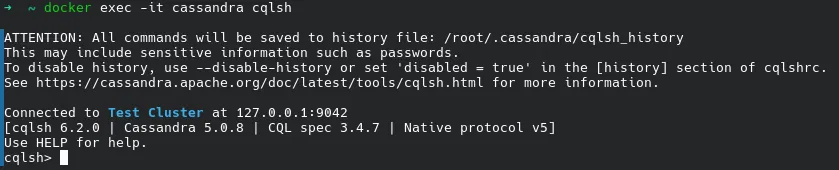
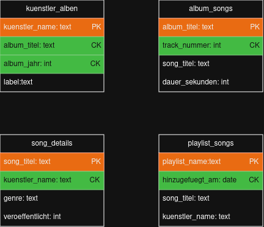
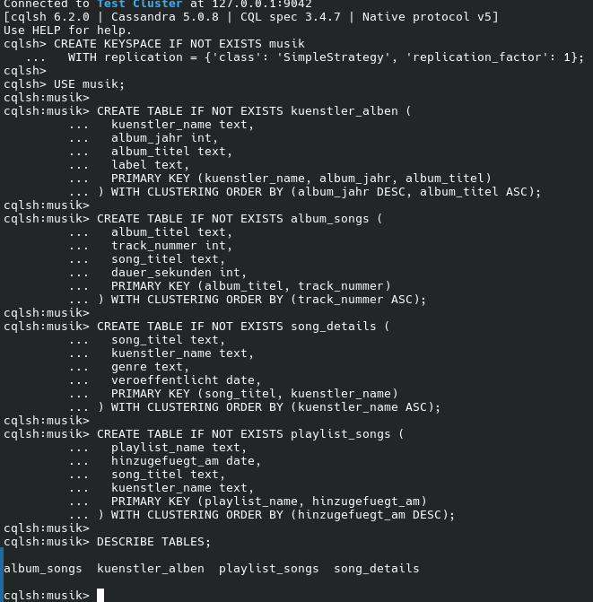

# kn-c-01

## a)  Installation / Account erstellen

## b) Logisches Modell für Cassandra

1. Künstler Seite `kuenstler_alben`
Benutzer öffnet Künstler Seite und sieht alle seine Alben.
Der `kuenstler_name` ist der Partition Key weil alle Alben des Künstlers zusammen auf dem selben Node
gespeichert werden. `album_jahr` und `album_titel` sind Cluster Keys damit die Alben sortiert und eindeutig sind.

2. Album Seite `album_songs`
Benutzer öffnet ein Album und sieht alle Songs in der richtigen Reihenfolge.
Der `album_titel` ist der Partition Key. 
`track_nummer` ist der Cluster Key damit die Songs automatisch nach Tracknummer sortiert gespeichert abgerufen werden.

3. Song Seite `song_details`
Benutzer klickt auf einen Song und sieht Details wie Genre, Künstler und Erscheinungsdatum.
Der `song_titel` ist der Partition Key. 
`kuenstler_name`ist der Cluster Key, weil derselbe Songtitel von verschiedenen Künstler existieren kann.

4. Playlist Seite `playlist_songs`
Benutzer öffnet eine Playlist und sieht alle Songs darin.
Der `playlist_name` ist der Partition Key.
`hinzugefuegt_am` ist der Cluster Key, damit die Songs sortiert angezeigt werden.

## c)
[cql_db.cql](cql_db.cql)

