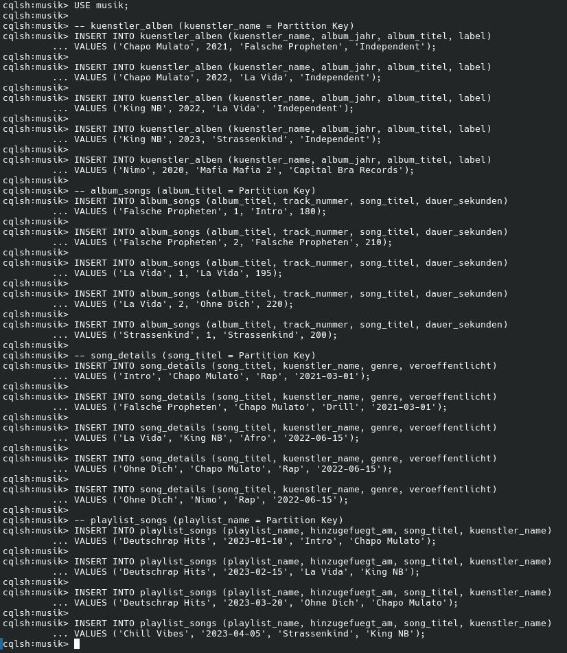
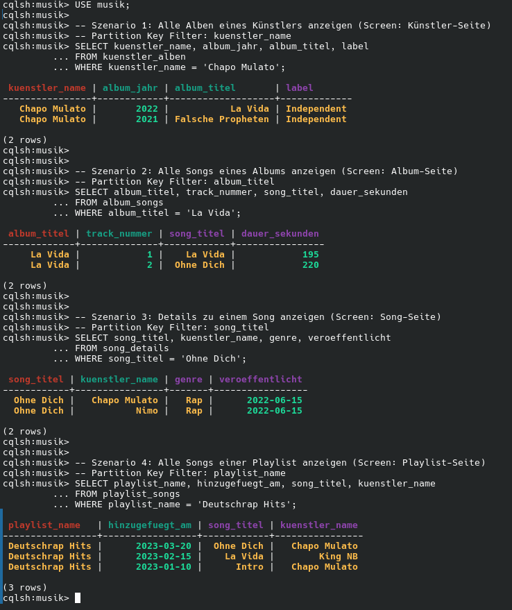
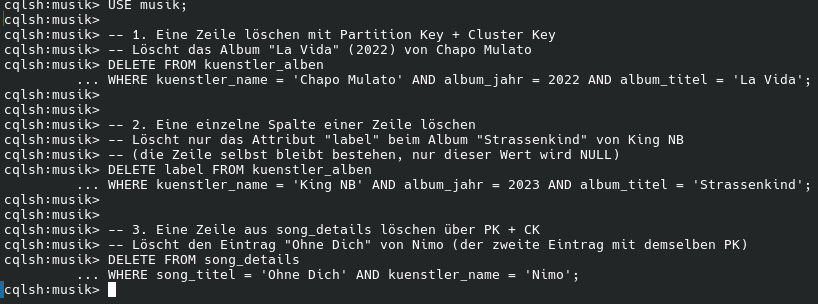
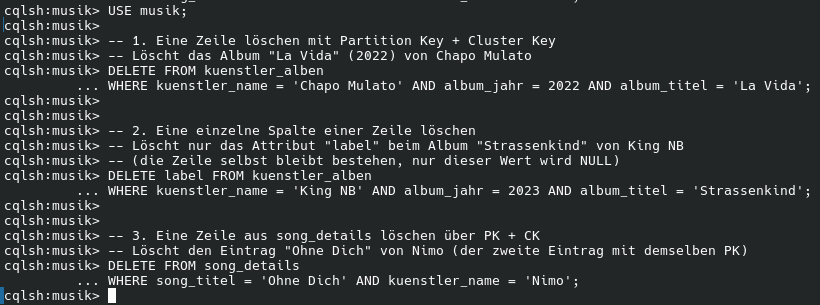

# kn c 02

##  A) Daten hinzufügen
[Insert data](knc02.txt)



## B) Daten abfragen
[Select data](select.txt)



## C) Daten löschen
[Delete data](deletedata.txt)



[Delete all](deleteall.txt)



## D) Daten verändern

Szenario 1: Label aktualisieren mit Bedingung (IF EXISTS)

Chapo Mulato hat einen neuen Plattenvertrag. Das Album "Falsche Propheten" soll das Label auf "Universal" ändern aber nur falls der Eintrag wirklich existiert 

```
UPDATE kuenstler_alben
SET label = 'Universal'
WHERE kuenstler_name = 'Chapo Mulato' AND album_jahr = 2021 AND album_titel = 'Falsche Propheten'
IF EXISTS;
```

Szenario 2: Attribut aktualisieren mit Bedingung (IF)

Der Song "Intro" wird neu gemastert: die Dauer ändert sich auf 185 Sekunden. IF dauer_sekunden = 180 stellt sicher, dass das Update nur ausgeführt wird, wenn der aktuelle Wert noch der erwartete alte Wert ist.

```
UPDATE album_songs
SET dauer_sekunden = 185
WHERE album_titel = 'Falsche Propheten' AND track_nummer = 1
IF dauer_sekunden = 180;
```

Szenario 3: Update mit TTL (Time To Live)

Ein Song wird für eine limitierte Promo-Aktion in einer Playlist hinzugefügt und soll nach einer bestimmten Zeit automatisch verschwinden, ohne dass man ihn manuell löschen muss.

```
UPDATE playlist_songs
USING TTL 86400
SET kuenstler_name = 'Chapo Mulato'
WHERE playlist_name = 'Deutschrap Hits' AND hinzugefuegt_am = '2023-01-10';
```

[Change Data](changedata.txt)