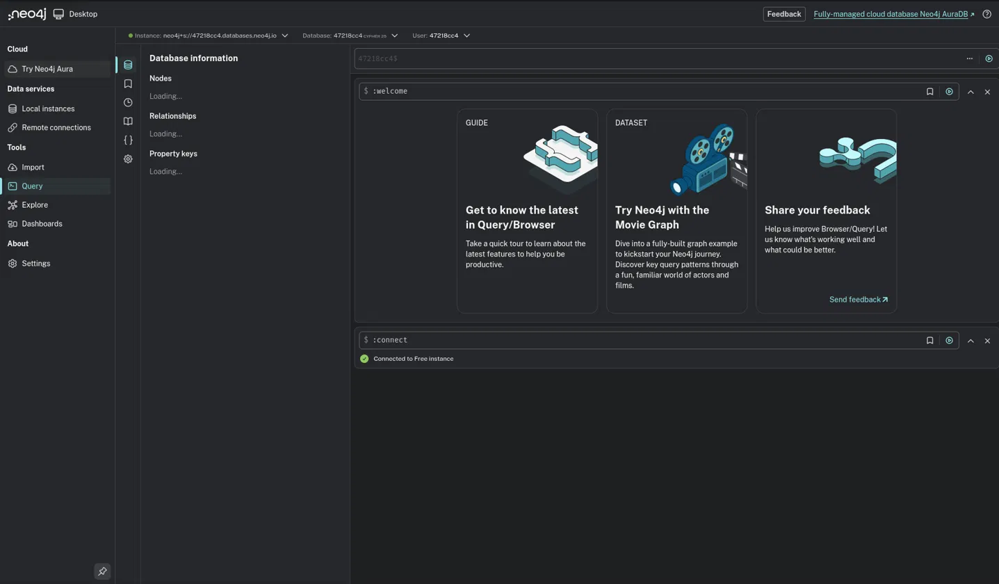
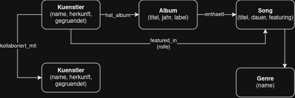

# kn n 01

## A) Installation / Account erstellen

## B) Logisches Modell für Neo4j

Kuenstler (name, herkunft, gegruendet)
Diese Attribute beschreiben den Künstler als eigenständige Entität, name identifiziert den Künstler, herkunft und gegruendet sind feste Eigenschaften, die sich nicht ändern je nachdem mit welchem Album oder Song man den Künstler verknüpft.

Album (titel, jahr, label)
Ein Album hat diese Eigenschaften unabhängig davon, welcher Künstler es veröffentlicht hat oder welche Songs es enthält. jahr und label sind Eigenschaften des Albums selbst und sie würden sich nicht ändern, wenn ein anderer Künstler dasselbe Album hätte. 

Song (titel, dauer, featuring)
Die Dauer eines Songs ist eine Eigenschaft des Songs selbst, unabhängig vom Album oder Künstler. featuring (true/false) sagt aus, ob der Song generell ein Feature enthält

Genre (name)
Einfachster Fall: ein Genre ist nur durch seinen Namen definiert, keine weiteren Eigenschaften nötig.
