# kn-n-02

## a) Daten hinzufügen
[createstatement](createstatement.txt)

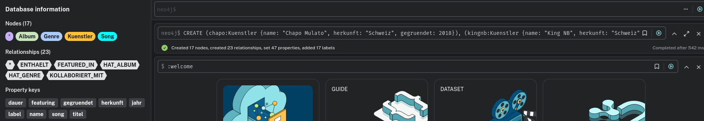

## b) Daten abfragen
Erklärung Abfragen:

```
MATCH (n) 
OPTIONAL MATCH (n)-[r]->(m) 
RETURN n, r, m
``` 

`MATCH (n)` – holt alle Knoten

`OPTIONAL MATCH (n)-[r]->(m)` – holt alle Beziehungen, aber wenn ein Knoten keine Beziehung hat, wird er trotzdem angezeigt (nicht weggelassen wie bei normalem MATCH)

`RETURN n, r, m` – gibt alles zurück

Szenario 1 – Alle Songs eines Künstlers anzeigen

Ein Benutzer möchte alle Songs sehen die Chapo Mulato auf seinen Alben hat.

```
MATCH (k:Kuenstler {name: "Chapo Mulato"})-[:HAT_ALBUM]->(a:Album)-[:ENTHAELT]->(s:Song)
RETURN k.name, a.titel, s.titel
```
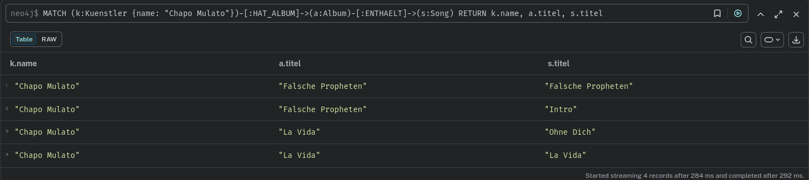

--- 

Szenario 2 – Alle Künstler die im Rap-Genre sind

Ein Benutzer möchte wissen welche Songs dem Genre Rap zugeordnet sind und von welchem Album sie stammen.

```
MATCH (s:Song)-[:HAT_GENRE]->(g:Genre)
WHERE g.name = "Rap"
MATCH (a:Album)-[:ENTHAELT]->(s)
RETURN s.titel, a.titel, g.name
```

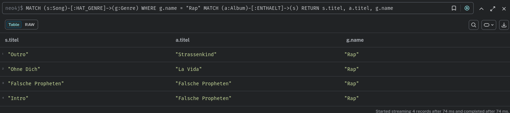

---

Szenario 3 – Alle Kollaborationen anzeigen

Ein Benutzer möchte sehen welche Künstler miteinander kollaboriert haben und woher sie kommen.

```
MATCH (k1:Kuenstler)-[:KOLLABORIERT_MIT]->(k2:Kuenstler)
WHERE k1.herkunft = "Schweiz"
RETURN k1.name, k2.name, k2.herkunft
```

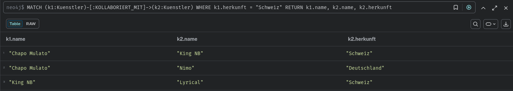

---

Szenario 4 – Songs mit Featuring und beteiligte Künstler

Ein Benutzer möchte alle Songs sehen bei denen ein Feature vorkommt und welche Künstler beteiligt sind.

```
MATCH (k:Kuenstler)-[:FEATURED_IN]->(s:Song)
OPTIONAL MATCH (a:Album)-[:ENTHAELT]->(s)
RETURN s.titel, k.name, a.titel
```

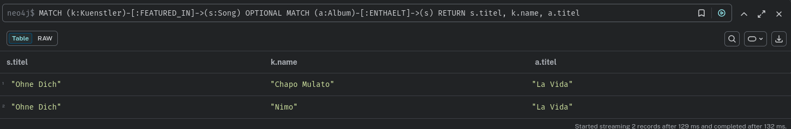

## c) Daten löschen

Graph vorher:
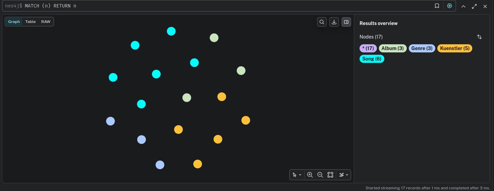

---

Ohne `DETACH`
```
MATCH (k:Kuenstler {name: "Eno"})
DELETE k
```
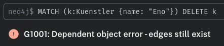

Mit `DETACH`
```
MATCH (k:Kuenstler {name: "Eno"})
DETACH DELETE k
```
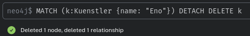

---

Graph nachher:
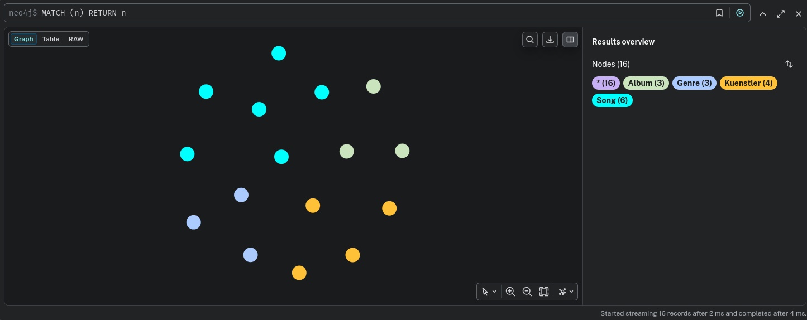

## d) Daten verändern

Szenario 1 – Knoten aktualisieren: Album-Label ändern
Chapo Mulato hat einen neuen Plattenvertrag unterschrieben. Das Album "Falsche Propheten" soll neu dem Label "Universal" zugeordnet werden.

```
MATCH (a:Album {titel: "Falsche Propheten"})
SET a.label = "Universal"
RETURN a.titel, a.label
```

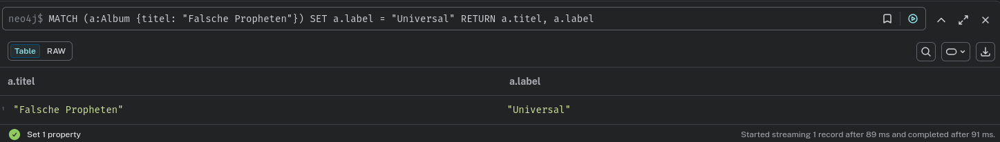

---

Szenario 2 – Knoten aktualisieren: Neues Attribut hinzufügen
Alle Schweizer Künstler sollen ein neues Attribut `aktiv` bekommen mit dem Wert `true`.

```
MATCH (k:Kuenstler)
WHERE k.herkunft = "Schweiz"
SET k.aktiv = true
RETURN k.name, k.aktiv
```

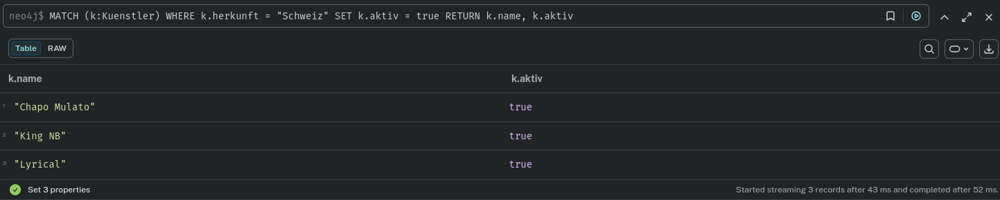

---

Szenario 3 – Kante aktualisieren: Featuring-Beziehung anpassen
Der Song "Ohne Dich" war ursprünglich ein Feature – jetzt soll die Beziehung ein zusätzliches Attribut jahr bekommen um zu zeigen wann das Feature stattfand.

```
MATCH (k:Kuenstler {name: "Chapo Mulato"})-[r:FEATURED_IN]->(s:Song {titel: "Ohne Dich"})
SET r.jahr = 2022
RETURN k.name, s.titel, r.jahr
```

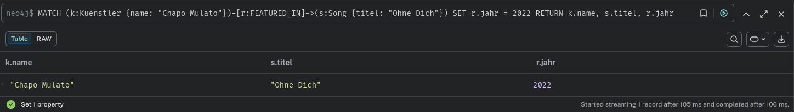

## e) Zustätzliche Klauseln

Klausel 1 – ORDER BY
Sortiert die Ergebnisse nach einem bestimmten Attribut, aufsteigend (ASC) oder absteigend (DESC).
Anwendungsfall: Ein Benutzer möchte alle Alben nach Erscheinungsjahr sortiert sehen, neueste zuerst.

```
MATCH (a:Album)
RETURN a.titel, a.jahr
ORDER BY a.jahr DESC
```

Klausel 2 – LIMIT
Begrenzt die Anzahl der zurückgegebenen Ergebnisse.
Anwendungsfall: Ein Benutzer möchte nur die 2 kürzesten Songs sehen – z.B. für eine Vorschau-Funktion.

```
MATCH (s:Song)
RETURN s.titel, s.dauer
ORDER BY s.dauer ASC
LIMIT 2
```