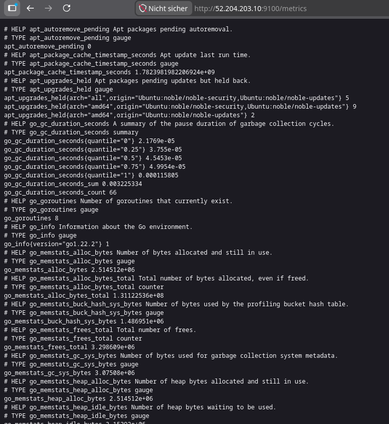
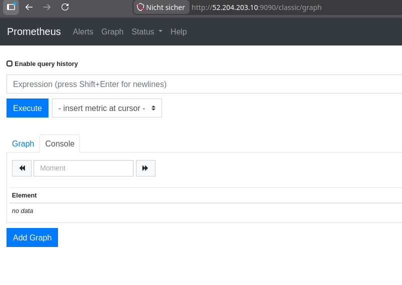
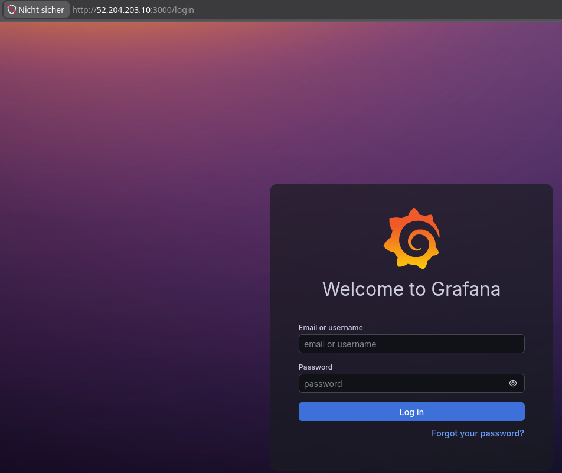
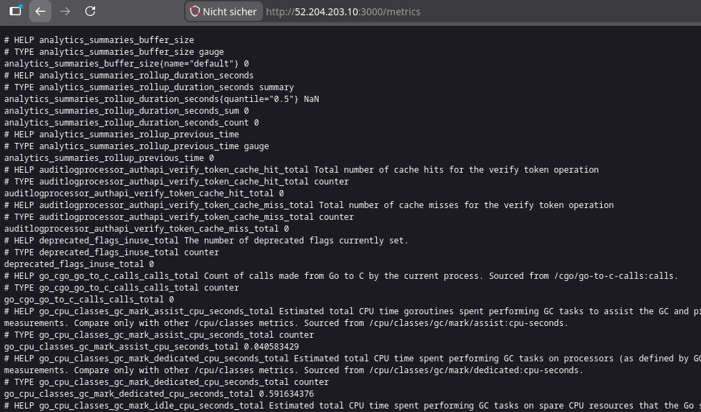

# kn-p-01

## A) Installation

/metrics

Prometheus Dashboard

Grafana Login

Grafana Metrics

## B) Erklärungen Cloud-Init

### 1. Was sind Scrapes?

Prometheus holt sich aktiv in einem festen Intervall (hier alle 15 Sekunden) Metriken von konfigurierten Zielen per HTTP ab. In der Config sind das zwei Ziele: Prometheus selbst auf Port 9090 und der Node Exporter auf Port 9100, der die Systemdaten (CPU, RAM, Disk) liefert.

### 2. Was sind Rules?

Rules sind Regeln die Prometheus auf den gesammelten Metriken ausführt. Es gibt zwei Arten: Recording Rules berechnen neue Metriken aus bestehenden (z.B. freier RAM in Prozent statt in Bytes). Alerting Rules lösen einen Alarm aus wenn eine Bedingung erfüllt ist (z.B. wenn ein System nicht mehr erreichbar ist).

### 3. Schritte um eigene Daten in Prometheus zu speichern?

1. In der eigenen App einen `/metrics`-Endpoint erstellen der Daten im Prometheus-Format ausliefert
2. Eine Prometheus-Client-Library verwenden (z.B. für Python oder Node.js)
3. Das neue Target in `prometheus.yml` unter `scrape_configs` eintragen
4. Prometheus neu starten

### 4. Welche Variablen werden verwendet und woher kommen sie?

In den Rules werden Metriken wie `node_memory_MemFree_bytes` und `node_filesystem_free_bytes` verwendet – diese kommen vom Node Exporter auf `localhost:9100/metrics`. Die Variable `up` ist intern von Prometheus und zeigt ob ein Target erreichbar ist. `$labels.instance` und `$labels.job` sind automatische Labels die Prometheus jedem Target anhängt.

### 5. Wie weiss Prometheus ob ein System up ist?

Prometheus setzt nach jedem Scrape automatisch `up = 1` wenn das Target erreichbar war, oder `up = 0` wenn nicht. Die Alerting Rule `InstanceDown` prüft ob `up == 0` länger als 1 Minute gilt – erst dann wird der Alert ausgelöst, um kurze Aussetzer zu ignorieren.