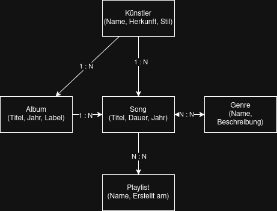
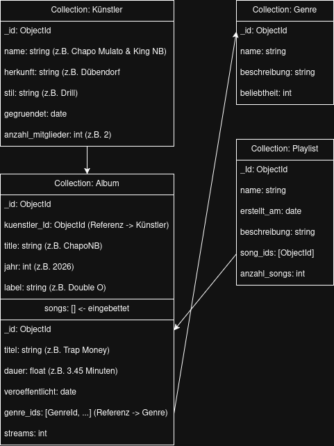
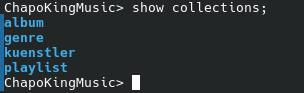

# kn02

## Konzeptionelles Datenmodell 

[Draw.io](konzeptionellesmodell.drawio)

### Entitäten:

Künstler: Repräsentiert einen Musiker oder ein Duo (z.B. King NB & Chapo Mulato). Attribute: Name, Herkunft, Stil.

Album: Eine Sammlung von Songs, die von einem Künstler veröffentlicht wurde. Attribute: Titel, Jahr, Label.

Song: Ein einzelner Musiktitel. Attribute: Titel, Dauer, Jahr.

Genre: Die Musikrichtung eines Songs (z.B. Rap, Drill, Afro). Attribute: Name, Beschreibung.

Playlist: Eine benutzerdefinierte Sammlung von Songs. Attribute: Name, Erstellt am.

### Beziehungen:

Künstler → Album (1:N): Ein Künstler kann mehrere Alben veröffentlichen aber ein Album gehört zu einem Künstler.

Künstler → Song (1:N): Ein Künstler kann mehrere Songs haben aber ein Song gehört zu einem Künstler.

Album → Song (1:N): Ein Album enthält mehrere Songs aber ein Song gehört zu einem Album.

Song ↔ Genre (N:N): Ein Song kann mehrere Genres haben (z.B. Rap und Drill) und ein Genre enthält viele Songs.

Song ↔ Playlist (N:N): Eine Playlist enthält viele Songs und ein Song kann in vielen Playlists vorkommen.

## Logisches Modell für MongoDB

[Draw.io](logischesmodell.drawio)

Hier ist die Erklärung für die Abgabe:

## Verschachtelung: Songs eingebettet in Album

Songs wurden direkt in die Album-Collection eingebettet weil Songs fast immer zusammen mit ihrem Album abgefragt werden. Zum Beispiel: "Zeige alle Songs von Album X". Mit der Einbettung kann das gesamte Album inklusive aller Songs mit einer einzigen Abfrage geladen werden.

### Referenz: genre_ids in Song

Ein Song kann mehrere Genres haben und ein Genre gehört zu vielen Songs (N:N). Eine Einbettung würde hier zu Redundanzen führen weil dasselbe Genre in vielen Songs wiederholt gespeichert werden müsste. Mit Referenzen wird das Genre nur einmal gespeichert und von vielen Songs referenziert.

### Referenz: song_ids in Playlist

Eine Playlist enthält viele Songs und ein Song kann in vielen Playlists sein (N:N). Auch hier wäre eine Einbettung nicht sinnvoll weil ein Song in hunderten Playlists sein könnte, das würde Redundanzen erzeugen. Mit Referenzen bleibt jeder Song einmal gespeichert und wird nur verlinkt.

##  Anwendung des Schemas in MongoDB

[Create File](create_collections.js)

