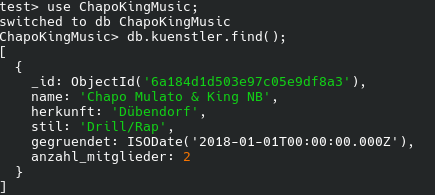
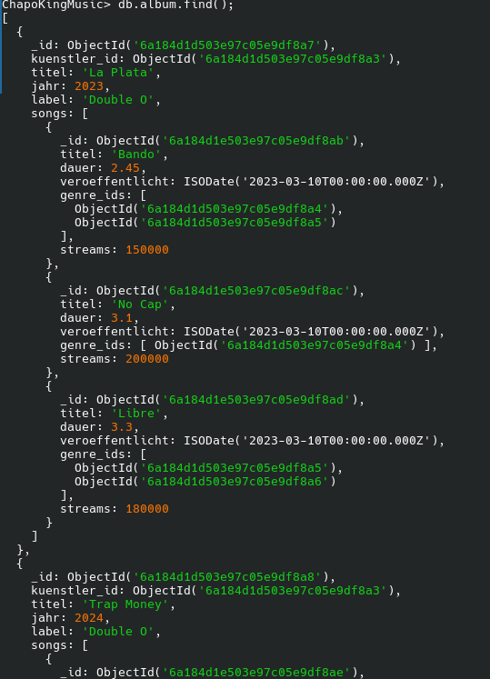
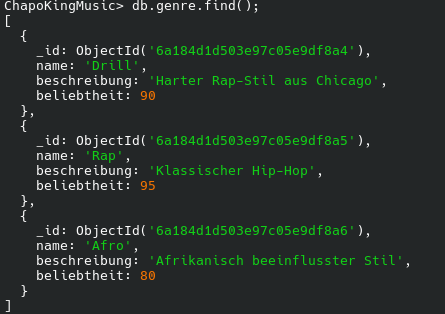
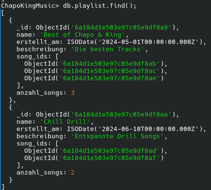
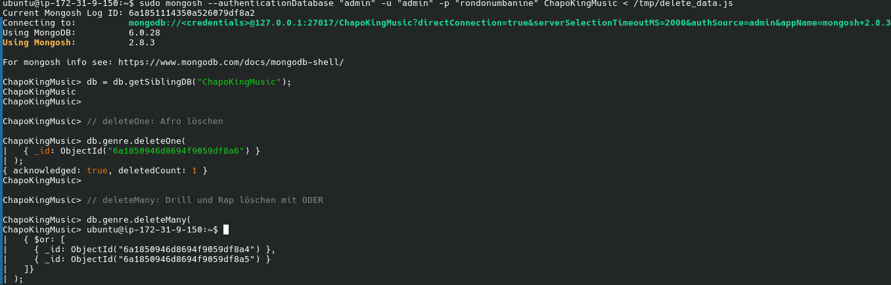
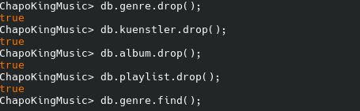
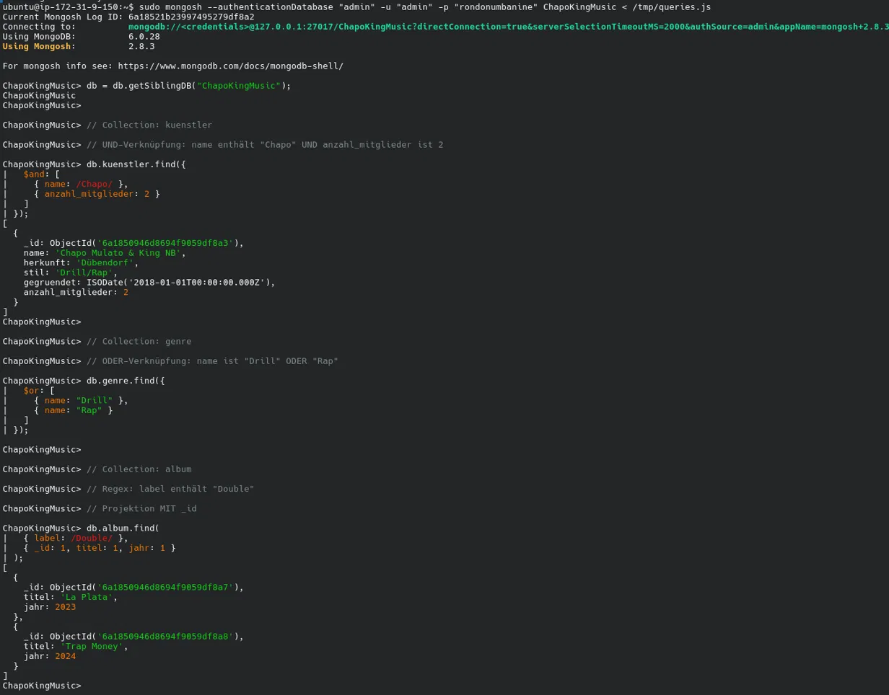
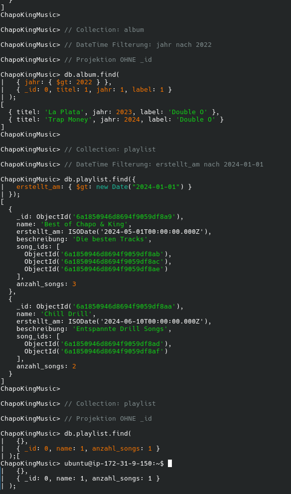
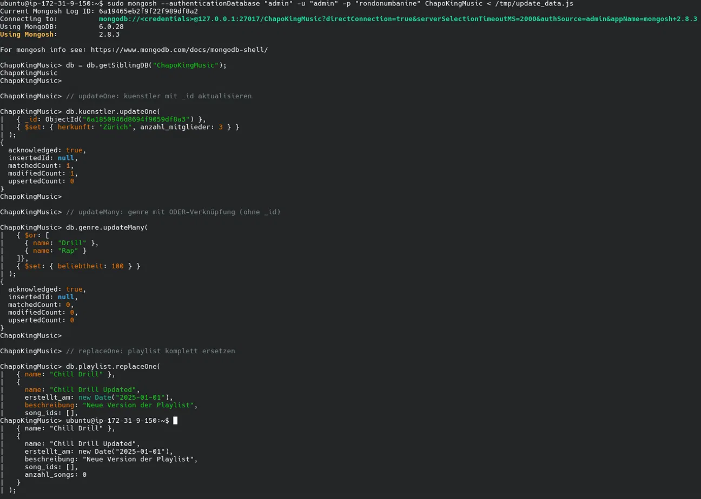
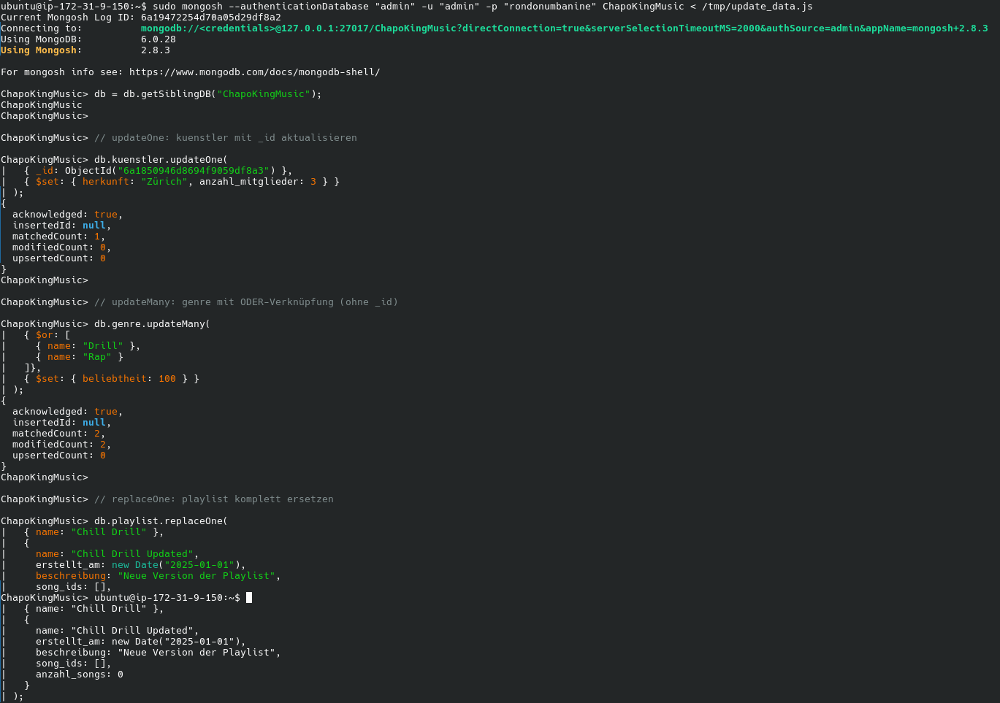

# kn03

## Daten hinzufügen
[insert_data.js](insert_data.js)

## Daten löschen
[drop_collections.js](drop_collections.js)

[delete_data.js](delete_data.js)

## Daten abfragen 
[queries.js](queries.js)

## Daten verändern
[update_data.js](update_data.js)

